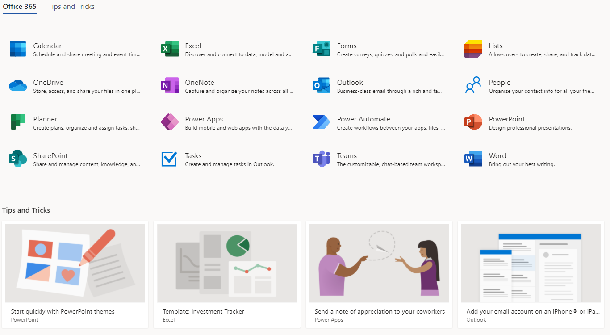

# Welcome

!!! caution
    This page is still under construction. Check back later for new content!

!!! abstract "Executive Overview"
    Commercial Virtual Remote (CVR) was decommissioned 15 June 2021. DoD365 is the department's overarching program to provide an enduring solution for on-site and remote office productivity and collaboration. DISA, U.S. Special Operations Command, and each service branch have established their own DoD365 tenant environments with different names and timelines for the implementation of features and capabilities embedded within the DoD365 environment. These timelines are based on individual requirements necessary to meet common cybersecurity and capability baselines to safeguard the DoD network infrastructure. 

There are two ways to access the Office365 Suite

1. On NIPR or VPN, go to [https://www.ohome.apps.mil/](https://www.ohome.apps.mil)
2. On commercial internet, go to [https://webmail.apps.mil/](https://webmail.apps.mil)

[:fontawesome-solid-external-link-alt:NIPR](https://www.ohome.apps.mil){ .md-button .md-button--primary } [:fontawesome-solid-external-link-alt:HOME](https://webmail.apps.mil){ .md-button .md-button--primary }