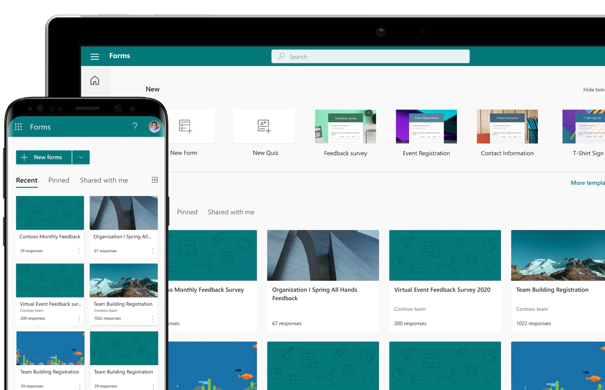

# Overview

!!! caution
    This page is still under construction. Check back later for new content!

Easily create surveys and polls to collect customer feedback, measure employee satisfaction, and organize team events. Quickly create quizzes to measure student knowledge, evaluate class progress, and focus on subjects that need improvement. Microsoft Forms automatically provides charts to visualize your data as you collect responses in real time.

