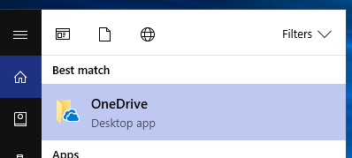
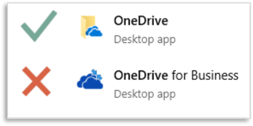
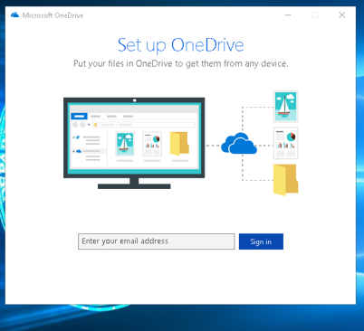
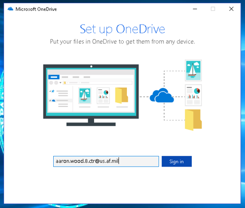
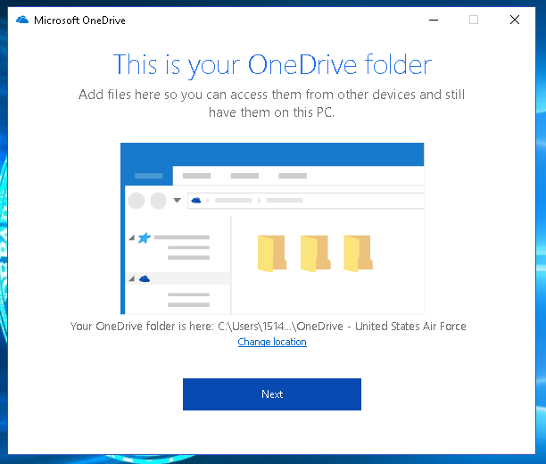
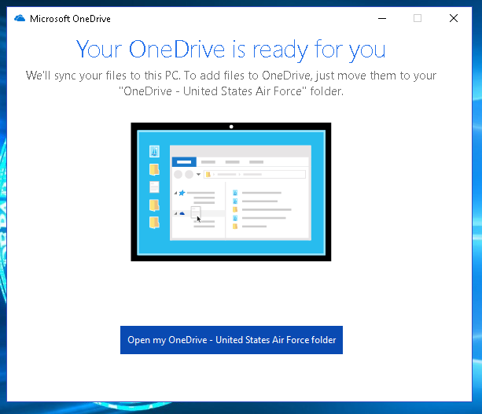
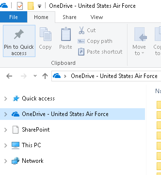

# Open OneDrive Desktop App

!!! caution
    This page is still under construction. Check back later for new content!

1. Hit the ++win++ key on your keyboard (or click the Windows icon in the lower left corner to launch the menu)
2. Type `onedrive` and you should see the OneDrive Desktop App like shown below

??? fail "Watch out for the wrong client"
    Do not select `OneDrive for Business`. That is an old client and will not work!  
    

When you launch the latest version of OneDrive, you should see the below screen pop-up to sign in.

!!! warning
    If you don't see this screen, and are presented with a screen asking to enter a SharePoint URL, you are using the old OneDrive client and should close that window and start over from step 1.

3. Enter your Air Force email address and click [Sign in](){ .md-button .md-button--primary }

!!! info
    The process might take a few minutes the first time. However, after signing in the first time, you should be auto-signed in each subsequent time.

You might be presented with a few options on initial sign-in as shown above. Most of these should be preset for you and you should simply click next until you reach the screen shown in the next image.

When the initial sign in is complete you should see a message similar to the image above. You can close or click the [Open my OneDrive-United States Air Force](){ .md-button .md-button--primary }

Your OneDrive is now accessible via the Windows File Explorer.

