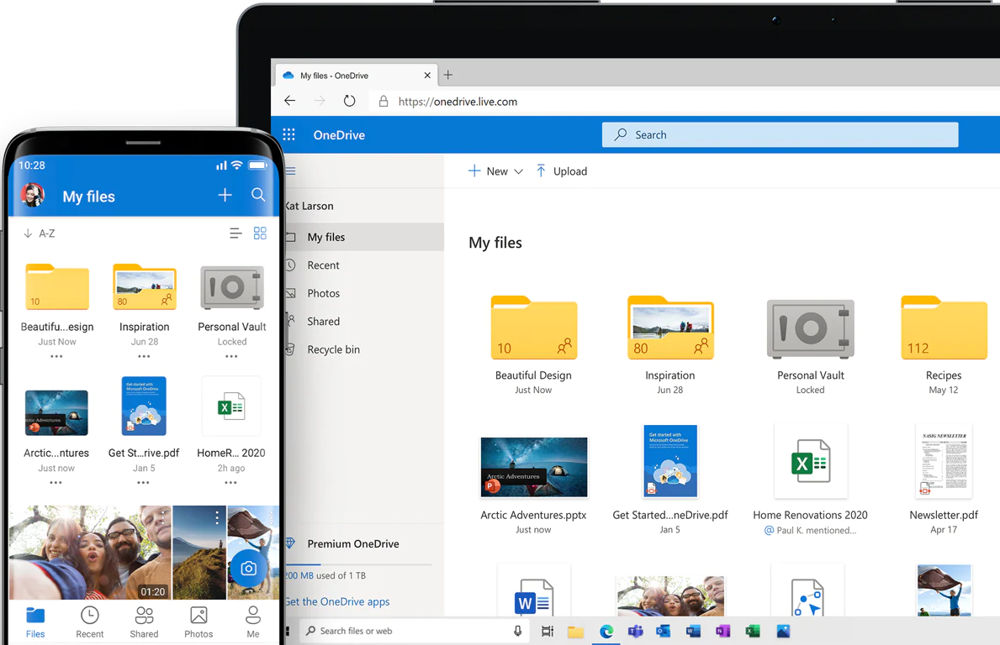

# Overview

!!! caution
    This page is still under construction. Check back later for new content!

MS OneDrive is the individual cloud storage component of Office 365. It is an innovative tool that provides unprecedented storage capacity and accessibility. When used with the desktop sync client, OneDrive ensures that a user’s files are always backed up and available in the cloud, making it easier to share data and collaborate than ever. OneDrive is an ideal location for storing user files, reducing reliance on physical computers and local network shared drives while safeguarding against lost data from hardware failure. OneDrive Capabilities and Features has been released and Air Force users now have access to up to 1 TB of personal cloud storage space in OneDrive.
*[MS]: Microsoft
*[TB]: Terabyte

OneDrive provides high encryption and authentication standards allowing CUI and PII to be stored in OneDrive but it can only be shared in accordance with current email governance.
*[CUI]: Controlled Unclassified Information
*[PII]: Personal Identifiable Information

??? info "Additonal Info"
    Do find out more about the Air Force's Data Loss Prevention, view the information in [Appendix 1 - Flow 3](../flow3.md)

## Version History