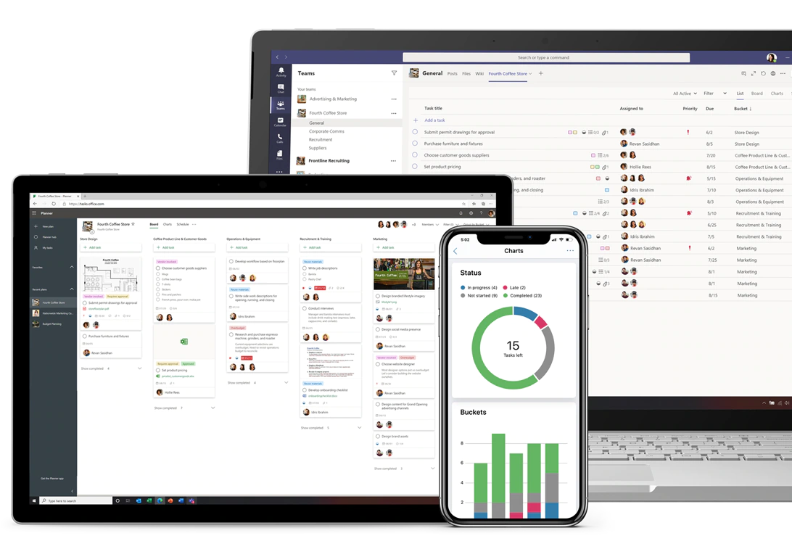

# Overview

!!! caution
    This page is still under construction. Check back later for new content!

Get more work done with Planner. Create Kanban boards using content-rich tasks with features including files, checklists, and labels. Collaborate in Planner and Microsoft Teams and check visual status charts—all in the Microsoft cloud.
*[Kanban]: A kanban board is one of the tools that can be used to implement kanban to manage work at a personal or organizational level. Kanban boards visually depict work at various stages of a process using cards to represent work items and columns to represent each stage of the process.

